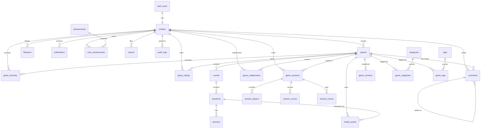

# Top Feud — Database ER Diagram

Generated for the schema in [`supabase/migrations`](../supabase/migrations). 25 tables
in `public`, every one protected by Row Level Security.

## Table groups

| Group | Tables |
|-------|--------|
| Identity & social | `profiles`, `followers` |
| Catalog | `games`, `game_versions`, `rounds`, `questions`, `answers`, `media_assets` |
| Taxonomy | `categories`, `tags`, `game_categories`, `game_tags` |
| Collaboration & community | `game_collaborators`, `game_favorites`, `game_ratings`, `comments`, `reports` |
| Live play | `game_sessions`, `session_players`, `session_scores`, `session_events` |
| Engagement | `notifications`, `achievements`, `user_achievements` |
| Security | `audit_logs` |

## Design highlights

- **Immutable publish snapshots.** `game_versions` stores a JSON snapshot of a game at
  publish time so creators can keep editing the live draft without affecting what players
  see, and can roll back. `games.current_version_id` points at the active snapshot.
- **Denormalized counters** (`favorites_count`, `rating_avg`, `rating_count`, `rounds_count`,
  `questions_count`, `comments_count`, followers/following, tag `usage_count`) are maintained
  by `SECURITY DEFINER` triggers so reads never pay for aggregation and writers don't need
  direct privileges on the parent rows.
- **Ordered children** use `(parent_id, position)` unique constraints (`rounds`, `questions`,
  `answers`) so reordering is a simple position swap.
- **Search.** A `pg_trgm` GIN index on `games.title` powers fuzzy discovery.
- **Authorization helpers** — `is_admin()`, `is_moderator()`, `can_view_game()`,
  `can_edit_game()`, `is_game_owner()`, `is_session_host()`, `is_session_member()` — are
  `SECURITY DEFINER` and centralize the access rules that the RLS policies reference, which
  keeps policies short and prevents recursive policy evaluation.

## RLS summary

| Concern | Rule |
|---------|------|
| Published games | Readable by everyone (`status = published` and not private) |
| Drafts | Readable/editable only by creator, editor-collaborators, moderators |
| Game edits | `creator` OR `editor`/`owner` collaborator OR `admin` |
| Profiles | Public read; self-update only; **role cannot be self-escalated** |
| Favorites / ratings | Public read; users manage only their own |
| Comments | Visible on viewable games; hidden ones only to author/moderator |
| Reports | Filed by anyone; visible to filer + moderators; resolved by moderators |
| Sessions | Joinable by code (open read); only the host mutates the session |
| Audit logs | Moderator/admin read only; append-only (no update/delete) |
