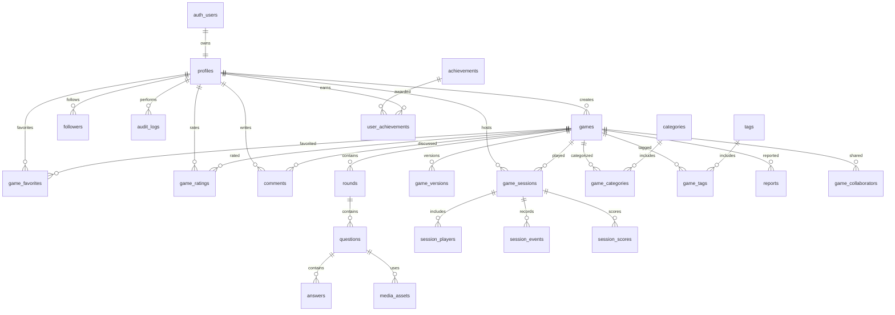

# Top Feud Production Roadmap

## Current Architecture

Top Feud is currently a small Next.js application with Supabase authentication and a minimal game session model.

Current stack in the repository:

- Next.js 14 App Router
- React 18
- TypeScript
- TailwindCSS
- Supabase Auth
- Supabase Postgres through `@supabase/ssr`
- Vercel deployment

Current app shape:

- `app/page.tsx`: landing page
- `app/login/page.tsx`: email/password login
- `app/register/page.tsx`: email/password registration
- `app/dashboard/page.tsx`: protected player dashboard
- `app/admin/page.tsx`: basic admin gate
- `app/game/[id]/page.tsx`: protected game session page
- `app/api/sessions/route.ts`: creates a basic game session
- `components/auth-form.tsx`: auth form
- `components/header.tsx`: shared header with signed-in user status
- `lib/supabase/*`: Supabase browser and server clients
- `supabase/schema.sql`: initial profiles and game_sessions schema

## Key Weaknesses

The current project is not production-ready yet. The main gaps are:

- Framework version mismatch: requested stack is Next.js 15 and React 19, but the repo is still Next.js 14 and React 18.
- Data model is too small: it only supports profiles and game sessions.
- No game catalog: no published games, game metadata, categories, tags, ratings, favorites, comments, or search.
- No creator workflow: no drafts, editor, rounds, questions, answers, media, collaborators, autosave, or version history.
- No play engine: no presenter mode, TV mode, scoring logic, timers, buzzers, realtime sync, sounds, or winner screen.
- Limited authorization: admin is gated by email and profile role, but there is no complete permission model.
- RLS is minimal: policies only cover profiles and sessions.
- No rate limiting or audit logging.
- No production observability, structured logging, analytics, or monitoring.
- No automated tests.
- No shadcn/ui, Framer Motion, or production component system.
- Several static HTML files remain from an earlier prototype and should be removed or archived after the app replacement is complete.
- Arabic text in several files has encoding damage and needs clean localization.

## Target Architecture

The production platform should be organized by feature:

```text
app/
  (marketing)/
  (app)/
    explore/
    games/[slug]/
    play/[sessionCode]/
    create/
    dashboard/
    profile/[handle]/
    leaderboard/
    admin/
features/
  auth/
  games/
  creator/
  play/
  profiles/
  community/
  moderation/
  analytics/
components/
  ui/
  layout/
  feedback/
lib/
  supabase/
  validation/
  security/
  analytics/
  rate-limit/
supabase/
  migrations/
  seed.sql
```

Server Components should handle data loading for browse/detail/dashboard pages. Server Actions should handle mutations where possible. Realtime channels should be reserved for live play sessions, presenter mode, buzzers, and scoring state.

## Proposed Database ER Diagram



## Core Tables To Add

- `games`: public game catalog entries.
- `game_versions`: immutable snapshots for version history and safe publishing.
- `rounds`: ordered rounds per game.
- `questions`: prompts within rounds.
- `answers`: answer text, points, and reveal order.
- `media_assets`: images, videos, audio, and sound effects.
- `categories`, `tags`, `game_categories`, `game_tags`: discovery taxonomy.
- `game_collaborators`: editor/owner roles per game.
- `game_favorites`, `game_ratings`, `comments`: community interaction.
- `followers`: creator graph.
- `reports`: abuse and moderation reports.
- `game_sessions`: live hosted sessions, extended from the current table.
- `session_players`, `session_scores`, `session_events`: realtime play state and audit trail.
- `notifications`: user notifications.
- `achievements`, `user_achievements`: progression.
- `audit_logs`: admin and security-sensitive actions.

## Security Model

- All tables must have RLS enabled.
- Public readable data should be limited to published, approved games and public profiles.
- Draft games should be visible only to owners and collaborators.
- Mutations must be authorized by ownership, collaborator role, or admin permission.
- Admin actions must write to `audit_logs`.
- Inputs must be validated with shared Zod schemas.
- Server Actions should enforce authorization even when RLS also exists.
- Rate limits should protect auth-adjacent actions, comments, ratings, reports, and session events.
- CSP headers should be configured before accepting user media embeds.

## Milestones

### Milestone 0: Architecture Baseline

Status: in progress.

- Document current architecture.
- Document production target architecture.
- Define ERD and schema direction.
- Clean broken auth/session build issues.
- Keep GitHub and Vercel green.

### Milestone 1: Platform Foundation

- Upgrade to Next.js 15 and React 19.
- Add shadcn/ui and a real design system.
- Add strict lint/typecheck scripts.
- Add basic test framework.
- Move from loose routes to feature-based folders.
- Remove or archive legacy static HTML files.
- Add production metadata, sitemap, robots, and basic security headers.

### Milestone 2: Database Foundation

- Convert `supabase/schema.sql` into versioned migrations.
- Add catalog tables: games, rounds, questions, answers, categories, tags.
- Add indexes, constraints, triggers, and RLS policies.
- Add seed data that represents real Family Feud games.
- Add audit logs and permission tables.

### Milestone 3: Discovery Platform

- Build Explore page.
- Build Search page with pagination.
- Build Categories pages.
- Build Game Details pages.
- Add ratings, favorites, likes, and creator cards.
- Add public profiles and follow buttons.

### Milestone 4: Game Creator

- Build game editor shell.
- Add draft creation and autosave.
- Add rounds, questions, answers, points, timers, and difficulty.
- Add media upload with Supabase Storage.
- Add preview mode and publish flow.
- Add version history and duplicate game.

### Milestone 5: Play Experience

- Build fullscreen play route.
- Add host, presenter, TV, and participant modes.
- Add realtime session state.
- Add keyboard shortcuts, touch controls, buzzers, scoreboard, winner screen, sounds, and confetti.
- Add share links and session codes.

### Milestone 6: Community

- Add comments, reports, moderation queue, badges, achievements, notifications, and activity feed.
- Add leaderboard scoring.
- Add anti-abuse limits.

### Milestone 7: Admin And Operations

- Build admin dashboard.
- Add user management, game moderation, reports, categories, tags, feature controls, permissions, analytics, and audit log viewer.
- Add observability and production runbooks.

### Milestone 8: Launch Hardening

- Full QA pass.
- Accessibility pass.
- Performance budget.
- SEO and structured data.
- Security review.
- Data backup policy.
- Final production deployment checklist.

## Immediate TODO

- Keep Vercel build green on `main`.
- Replace damaged Arabic strings with clean localized text.
- Add `typecheck` and modern lint scripts.
- Decide whether migration to Next.js 15 happens before or after schema expansion. Recommended: before schema expansion.
- Move the current SQL into `supabase/migrations`.
- Design and apply the first normalized game catalog migration.
- Replace placeholder game/session pages with real data-backed pages.
- Add tests around auth, RLS expectations, and session creation.

